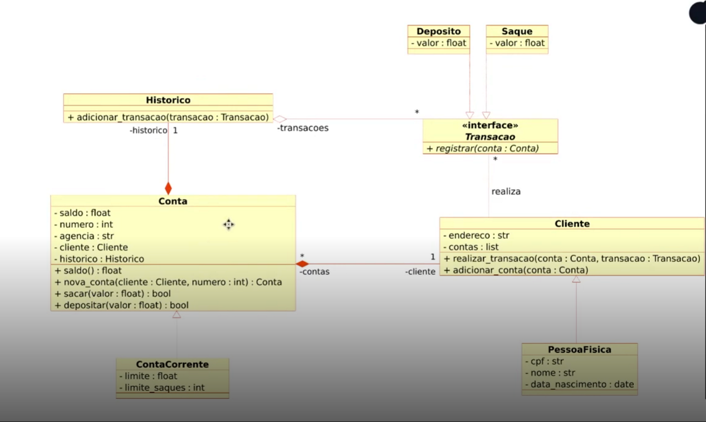

# Sistema bancário 🌟

Atividade lab proposta pela DIO para treinar e reforçar os conhecimentos em POO e a modularização do código. O projeto tenta seguir algumas boas práticas de arquitetura limpa (ainda em treinamento) para reforçar conhecimentos adquiridos em outras vivências.
# Diretórios 📖
/src/doamin/entities -> mantem as classes, seus atributos essenciais e funções getters e setters além de outras especificações.

/src/domain/repository -> mantem as entidades para execução das tarefas e interações necessárias para o sistema

/main.py -> Arquivo responsável por executar toda a lógica criada no repositório.

# Diagrama referência

